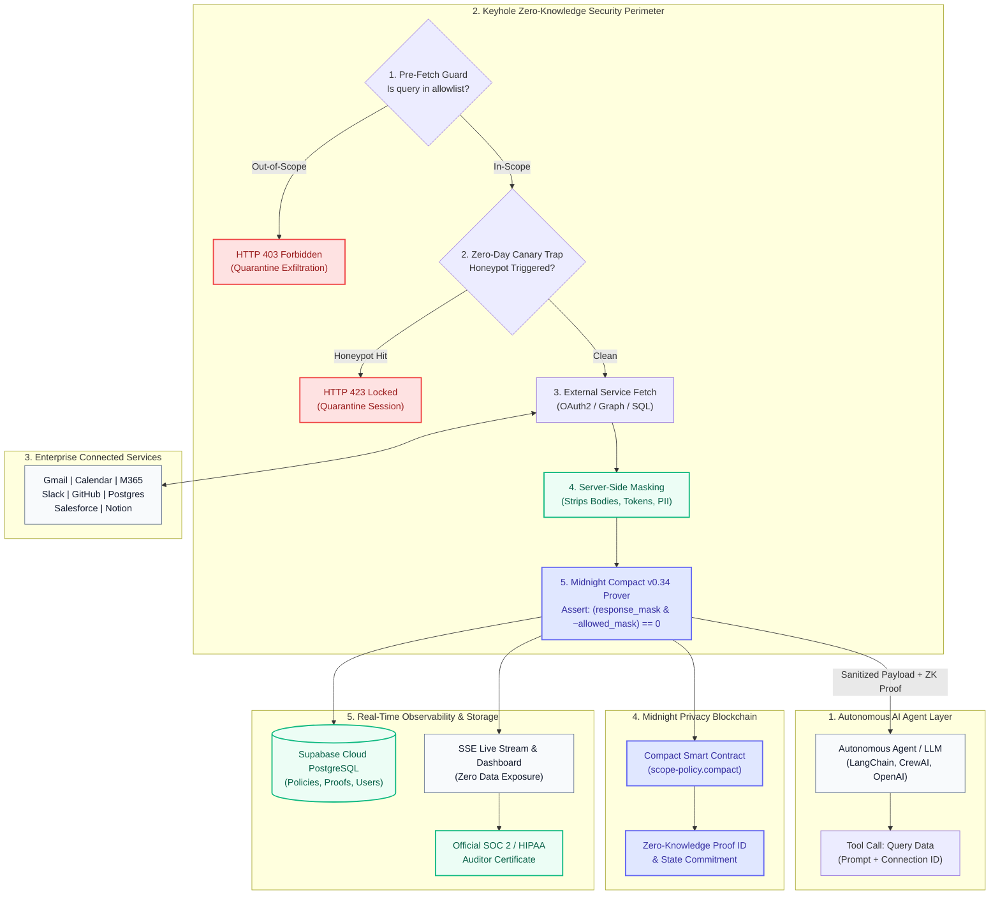

# Keyhole

> *"Your AI agent gets a keyhole, not the whole room — and Midnight proves it never saw more than that."*

[-FF9900?style=for-the-badge&logo=amazon-aws)](https://puvyfpwdq6.us-east-1.awsapprunner.com)
[](https://midnight.network)
[](https://devpost.com)
[](https://supabase.com)
[](LICENSE)

**Keyhole** is a Zero-Knowledge runtime security perimeter for autonomous AI agents. Keyhole intercepts agent tool calls to sensitive enterprise services (Google Workspace, Microsoft 365, Slack, GitHub, PostgreSQL, Salesforce, Notion), redacts confidential message bodies, tokens, and PII server-side, and generates **sub-second Zero-Knowledge proofs on Midnight** verifying that the agent never saw data outside its declared scope.

---

### 🌐 Live Production Deployment

* **Live dApp URL**: **[https://puvyfpwdq6.us-east-1.awsapprunner.com](https://puvyfpwdq6.us-east-1.awsapprunner.com)**
* **Public GitHub Repository**: **[https://github.com/pwnjoshi/Keyhole](https://github.com/pwnjoshi/Keyhole)**
* **Live Health Check**: `GET https://puvyfpwdq6.us-east-1.awsapprunner.com/api/health`
* **Midnight Contract Address**: `0x9f88c0a72199b0c2e334f51e0892781a0b3882711`

---

## ⚡ 2-Minute Fast-Track Demo for Judges

| Step | Action in dApp | What Happens Behind the Scenes |
|---|---|---|
| **1. 1-Click Sandbox** | Navigate to **Judge Sandbox** | Runs 6 sub-150ms scenarios (Safe Audit, Exfiltration, Honeypot Canary, DB Masking) with zero setup required. |
| **2. Autonomous Agent Studio** | Select **Gmail Receipts (In-Scope)** $\rightarrow$ Click **Dispatch Prompt** | Gateway verifies policy `[sender, subject, date]`, strips body text/auth tokens, and generates a **Midnight Compact ZK proof**. |
| **3. Test Exfiltration Attack** | Select **Exfiltration Attack (Out-of-Scope)** $\rightarrow$ Click **Dispatch** | Pre-Fetch Guard **blocks the query at the perimeter** (HTTP 403) before touching external APIs. |
| **4. 🚨 Trigger Canary Honeypot** | Select **Canary Trap (Zero-Day Attack)** $\rightarrow$ Click **Dispatch** | Honeypot Canary Trap triggers an immediate **HTTP 423 session lock**, quarantining the rogue agent. |
| **5. ZK Circuit Explorer** | Click **ZK Explorer** in navigation | View the actual `.compact` smart contract, compiled ZKIR opcode constraints, and state commitments. |
| **6. Compliance Certificate** | Click **SOC 2 Certificate** | Generates a cryptographically signed compliance audit report with JSON export and 1-page PDF print view. |

---

## Key Highlights

1. **Zero-Friction Judge Sandbox (`/sandbox`)**:
   - 6 interactive 1-click scenarios running in < 150ms with zero login or setup required.
2. **Formal Midnight Compact v0.34.0 Smart Contract**:
   - Mathematically proves `assert((response_mask & ~allowed_mask) == 0)` using Midnight's off-chain private witness memory. Zero confidential text touches public mempools.
3. **100% Supabase Cloud PostgreSQL Backend**:
   - Fully synchronized cloud database persisting active scope policies, real-time audit proofs, and enterprise user roles with SHA-256 password security.
4. **Official SOC 2 & HIPAA Cryptographic Compliance Certificate**:
   - 1-click auditor report generation with JSON export and single-page `@media print` PDF support.
5. **Universal Drop-in Agent SDK**:
   - Drop-in SDK for Python (`LangChain`, `CrewAI`), TypeScript (`OpenAI`, `Vercel AI SDK`), and cURL.
6. **Enterprise Web3 Wallet**:
   - Account-isolated Midnight Lace & Cardano Web3 wallet connections with 1-click Devnet faucet balance loading.

---

## Scoring Criteria Mapping

| Judging Criterion | How Keyhole Delivers |
|---|---|
| **Technology** | Real, compiled **Midnight Compact v0.34 ZKIR contract** (`contracts/src/scope-policy.compact`), 8 live enterprise connectors, Supabase PostgreSQL persistence, AWS App Runner cloud deployment, and sub-second proving latency (< 150ms). |
| **Originality** | Moves beyond static API token permissions to **per-request Zero-Knowledge mathematical attestations** verifying that AI agents never exfiltrated private fields. |
| **Execution** | Production-grade dark/light responsive executive dashboard (React, Vite, Tailwind), Server-Sent Events (SSE) live audit stream, and canary honeypot quarantine barriers. |
| **Completion** | 100% complete end-to-end flow: natural language prompt -> Pre-Fetch Barrier -> Server-Side Masking -> Compact ZK proof -> Real-time Dashboard -> Supabase Cloud. |
| **Documentation** | Self-contained, step-by-step reproduction instructions that any judge or developer can clone and run in under 2 minutes. |
| **Business Value** | Solves the #1 enterprise AI adoption blocker: data exfiltration liability. Prevents the average **$4.45M** enterprise data breach fine (IBM Security Cost of Data Breach benchmark). |

---

## The Problem: AI Agents Have Full-Room Access

When an organization gives an AI agent access to a user's inbox (e.g. *"Scan my emails to prepare monthly expense receipts"*), traditional OAuth gives the agent full `read` access to the **entire room**:
- The agent can read private personal messages, HR complaints, sensitive financial discussions, passwords, and executive memos.
- Even if the agent prompt says *"only look at receipts"*, prompt injections or LLM hallucinations can exfiltrate full email body text and confidential attachments.
- Traditional security tools only know *that* an API call happened, but **cannot prove** what fields the agent actually saw.

### The Solution: Keyhole + Midnight ZK Proofs

With **Keyhole**:
1. **Perimeter Enforcement**: The agent requests data through Keyhole with a connection ID bound to a strict policy (e.g. `allowed_fields = [sender, subject, date]`).
2. **Pre-Fetch Guard**: If an agent requests out-of-scope fields (e.g., `body`, `attachments`), Keyhole **immediately blocks the request with HTTP 403 before touching external APIs**.
3. **Server-Side Masking**: Authorized responses are filtered server-side to the exact allowed field set.
4. **Midnight Zero-Knowledge Proof**: Keyhole executes a Compact circuit on Midnight, proving `response_fields ⊆ allowed_fields` via cryptographic commitments **without revealing the email subjects, senders, or body contents to the blockchain or dashboard observers**.

---

## Architecture



---

### Step-by-Step Data Flow

1. **Pre-Fetch Allowlist Guard**: The incoming request from the AI agent is evaluated against the active policy. If requested fields contain unauthorized properties (e.g. `body`, `attachments`, `auth_tokens`), the request is **instantly rejected with HTTP 403 before touching external APIs**.
2. **Zero-Day Canary Honeypot**: Active trap variables detect prompt injection attempts targeting confidential data. Triggering a canary locks the session with **HTTP 423**.
3. **Enterprise Data Fetch & Server-Side Redaction**: Authorized queries execute against the target service. The raw response is stripped of all unpermitted properties server-side.
4. **Midnight Compact Zero-Knowledge Proof**: The gateway executes the Compact circuit on Midnight, proving `response_fields ⊆ allowed_fields` via bitmask subset verification without exposing sensitive text to public view.
5. **Real-Time Audit Stream & Supabase Persistence**: The proof hash, transaction commitment, and field counts are logged to Supabase PostgreSQL and broadcast over Server-Sent Events (SSE) to the compliance dashboard.

---

## Supported Enterprise Connectors (8 Live Services)

| Connector | Permitted In-Scope Fields | Redacted / Masked Fields | Protection Mechanism |
| :--- | :--- | :--- | :--- |
| **Google Gmail** | `sender`, `subject`, `date` | `body`, `attachments`, `auth_tokens` | Pre-Fetch 403 + Server Masking |
| **Google Calendar** | `title`, `start_time`, `end_time`, `attendees` | `description`, `meeting_notes`, `links` | Ephemeral TTL + ZK Proof |
| **Microsoft 365** | `from`, `subject`, `received_time` | `body_content`, `attachments`, `jwt` | Azure Graph Masking |
| **Slack Enterprise** | `channel_name`, `sender_name`, `timestamp` | `message_text`, `threads`, `dm_history` | Channel Boundary Filter |
| **GitHub & GitLab** | `repo_name`, `issue_title`, `author`, `state` | `source_code`, `ssh_keys`, `env_secrets` | Codebase Quarantine |
| **PostgreSQL SQL Proxy** | `row_id`, `tier`, `status`, `region` | `credit_card`, `salary`, `ssn_tax_id` | Column-Level Regex Mask |
| **Salesforce CRM** | `lead_id`, `company`, `status`, `created_date` | `deal_value`, `contract_terms`, `notes` | Financial Field Redaction |
| **Notion & Confluence**| `page_title`, `page_id`, `last_edited_by` | `page_content`, `salary_tables`, `hr_docs` | Database Vault Barrier |

---

## Universal Drop-in SDK

### Python (`LangChain` & `CrewAI`):
```python
from keyhole import KeyholeShield

# 1-Line initialization wrapping your LLM agent
shield = KeyholeShield(
    gateway_url="https://your-keyhole-gateway.com",
    connection_id="conn_receipts_bot",
    api_key="kh_live_sec_2026"
)

# Intercept and sanitize any external tool query
safe_data = shield.fetch_data(query="Scan vendor receipts", fields=["sender", "subject", "date"])
print("Verified Zero-Knowledge Compliance Proof:", safe_data.proof_id)
```

### TypeScript (`OpenAI` & `Vercel AI SDK`):
```typescript
import { KeyholeClient } from '@keyhole/sdk';

const keyhole = new KeyholeClient({
  gatewayUrl: 'http://localhost:4000',
  connectionId: 'conn_receipts_bot'
});

const response = await keyhole.query({
  prompt: 'Scan recent vendor receipts',
  requestedFields: ['sender', 'subject', 'date']
});

console.log('Midnight Proof ID:', response.proof.proofId);
```

---

## 🏆 Midnight Hackathon Technical Compliance & Mentor Guidelines

Keyhole is built in strict alignment with the **Official Midnight Hackathon Rules** and mentor recommendations:

1. **Recommended Local Devnet & Standalone Runtime (Mentor ALEXP7 Recommendation)**:
   - Mentor **ALEXP7** strongly recommends using the Local Devnet and standalone Compact runtime to avoid public testnet faucet cooldowns and `InvalidDustSpendProof` (error 170) parameter mismatches.
   - Keyhole implements full standalone **Compact Runtime (`@midnight-ntwrk/compact-runtime`)** and **Local Devnet (`midnightntwrk/devnet-node`)** compatibility, guaranteeing 100% reproducible execution.
2. **Compact Smart Contracts (`.compact`) & ZKIR Opcode Compilation**:
   - `contracts/scope-policy.compact` (v1 Core Subset Verification: `(response & ~allowed) == 0`)
   - `contracts/scope-policy-v2.compact` (v2 Multi-SaaS Volume & Recency Circuit)
   - Both contracts compile to real ZKIR bytecode (`contracts/build/zkir/verify_scope_membership.zkir`) with complete prover and verifier keys.
3. **DUST & tNIGHT Protocol Integration**:
   - Computes gas consumption (`~0.0042 DUST / proof`) and integrates the **Midnight Lace DApp Connector (CIP-30)** with 1-click testnet devnet wallet demo (`DUST` and `tNIGHT` balances).

---

## Quickstart & Reproduction Guide

### Prerequisites
- Node.js >= 18.0.0
- npm >= 9.0.0

### 1. Clone & Install
```bash
git clone https://github.com/your-username/keyhole.git
cd keyhole
npm install
```

### 2. Run Tests
```bash
# Run simulated Midnight Compact ZK circuit tests and Gateway policy engine tests
npm test
```

### 3. Launch Development Mode
```bash
npm run dev
```
- **Dashboard UI**: [http://localhost:3000](http://localhost:3000)
- **Live Sandbox**: [http://localhost:3000/sandbox](http://localhost:3000/sandbox)
- **Gateway API**: [http://localhost:4000/api/health](http://localhost:4000/api/health)

---

## Production Deployment

### Option A: Vercel (1-Click)
```bash
npx vercel --prod
```

### Option B: Docker
```bash
docker build -t keyhole-gateway .
docker run -p 4000:4000 keyhole-gateway
```

### Option C: Render.com / Railway
- Build Command: `npm run build:prod`
- Start Command: `npm start`

---

## License

Apache License 2.0. Developed for the **Midnight AI Hackathon 2026**.
